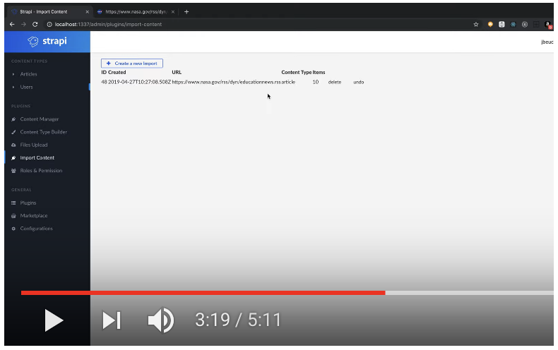

# Strapi Import Content plugin

Import RSS items to your content type with Strapi.

[](https://dev.azure.com/joebeuckman0156/strapi-plugin-import-content/_build/latest?definitionId=1&branchName=master)

### Installation

```
cd my-strapi-project/plugins
git clone https://github.com/jbeuckm/strapi-plugin-import-content.git import-content
cd import-content && npm install
cd ../..
npm run setup --plugins
```

_\* the last step takes a notoriously long time..._

### Usage

Click for video demo:
[](https://youtu.be/NOFioYMKPJk)
